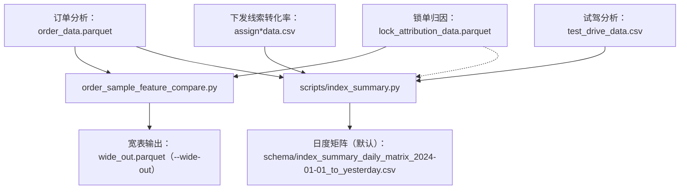

下发线索转化率：/Users/zihao\_/Documents/coding/dataset/original/assign\*data.csv
试驾分析：/Users/zihao\_/Documents/coding/dataset/original/test_drive_data.csv
订单分析：/Users/zihao\_/Documents/coding/dataset/formatted/order_data.parquet
锁单归因：/Users/zihao\*/Documents/coding/dataset/formatted/lock_attribution_data.parquet
选配信息：/Users/zihao\_/Documents/coding/dataset/formatted/config_attribute.parquet

---

智己大区分布：/Users/zihao\_/Documents/coding/dataset/original/store_region_business_definition_data.csv

---

