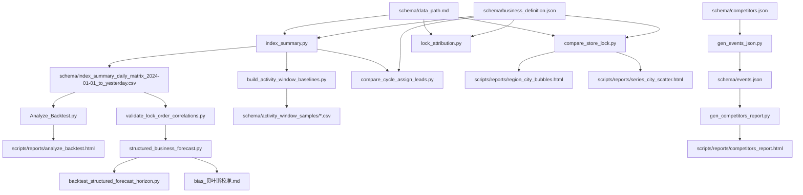

## scripts 脚本说明

### 脚本/文件索引

```json
[
  {
    "type": "script",
    "path": "scripts/compare_store_lock.py",
    "updated_at": "2026-04-29 00:00",
    "purpose": "对比车系“上市后 N 天”锁单（新/老门店拆分）；可选大区汇总、城市榜单、城市图表（气泡/散点）。",
    "inputs": [
      "schema/data_path.md（订单分析必需；智己大区分布可选）",
      "schema/business_definition.json（time_periods/series_group_logic/product_type_logic）"
    ],
    "outputs": [
      "stdout：新门店/老门店对比表",
      "stdout：城市榜单（可选，--with-city-rank）",
      "scripts/reports/region_city_bubbles.html（可选，--by-region；窗口 --region-city-bubble-days）",
      "scripts/reports/series_city_scatter.html（可选，--series-city-scatter-out；窗口 --series-city-scatter-days）"
    ]
  },
  {
    "type": "script",
    "path": "scripts/channel_cohort_compare.py",
    "updated_at": "2026-04-29 00:00",
    "purpose": "对比两份“渠道归因_YYYYMMDD.csv”在各渠道大类的 Cohort 规模与锁单/小订归因差异（B-A），并输出 HTML。",
    "inputs": ["渠道归因_YYYYMMDD.csv（A）", "渠道归因_YYYYMMDD.csv（B）"],
    "outputs": [
      "out/channel_cohort_compare_<A>_vs_<B>.html（默认）",
      "out/<stem>_report.html（A/B 明细，内部调用 channel_cohort_conversion）"
    ]
  },
  {
    "type": "script",
    "path": "scripts/channel_cohort_conversion.py",
    "updated_at": "2026-04-29 00:00",
    "purpose": "读取“渠道归因”CSV（支持 Long→Wide），按 Cohort 时间窗回溯用户全局触达，并对锁单/小订做转化归因；输出 HTML 报告。",
    "inputs": ["渠道归因_YYYYMMDD.csv（utf-16/utf-8；tab/comma；支持 Long/Wide）"],
    "outputs": ["out/<stem>_report.html（默认）"]
  },
  {
    "type": "script",
    "path": "scripts/order_sample_feature_compare.py",
    "updated_at": "2026-04-28 00:00",
    "purpose": "订单抽样特征对比：按订单号清单或自然语言条件筛 A/B，打通业务定义与选配宽表，输出画像或差异摘要（占比/均值/SMD/缺失率）。",
    "inputs": [
      "schema/data_path.md（可选）",
      "schema/business_definition.json（可选）",
      "order_data.parquet",
      "config_attribute.parquet（可选）"
    ],
    "outputs": ["stdout：画像/差异摘要", "out/*.parquet|*.csv（可选，--wide-out）", "out/*.md（可选，--md-out）"]
  },
  {
    "type": "script",
    "path": "scripts/index_summary.py",
    "updated_at": "2026-04-27 14:30",
    "purpose": "单日/区间指标汇总；无参模式维护日度矩阵 CSV。",
    "inputs": ["schema/data_path.md（订单/线索/试驾/可选归因等）"],
    "outputs": ["stdout：JSON（单日/可选）", "schema/*：日度矩阵 CSV（默认写入）"]
  },
  {
    "type": "script",
    "path": "scripts/compare_cycle_assign_leads.py",
    "updated_at": "2026-04-21 20:13",
    "purpose": "对比两个窗口（A/B）线索相关指标均值；内部调用 index_summary。",
    "inputs": ["A/B 日期窗口（或已生成 JSON）", "index_summary 所需数据"],
    "outputs": ["stdout：对比表", "out/index_summary_*.json/.csv（可选写 md）"]
  },
  {
    "type": "script",
    "path": "scripts/Analyze_Backtest.py",
    "updated_at": "2026-04-20 09:58",
    "purpose": "从日度矩阵生成综合可视化 HTML 报告（趋势/相关性/分层等）。",
    "inputs": ["日度矩阵 CSV"],
    "outputs": ["scripts/reports/analyze_backtest.html"]
  },
  {
    "type": "script",
    "path": "scripts/gen_competitors_report.py",
    "updated_at": "2026-04-16 15:30",
    "purpose": "将 schema/events.json 渲染成竞品关键时间点 HTML 报告。",
    "inputs": ["schema/events.json"],
    "outputs": ["scripts/reports/competitors_report.html"]
  },
  {
    "type": "script",
    "path": "scripts/gen_events_json.py",
    "updated_at": "2026-04-16 14:42",
    "purpose": "从 schema/competitors.json 为某车系生成竞品事件维护模板 events.json。",
    "inputs": ["schema/competitors.json"],
    "outputs": ["schema/events.json"]
  },
  {
    "type": "script",
    "path": "scripts/structured_business_forecast.py",
    "updated_at": "2026-04-16 10:54",
    "purpose": "结构化预测（锁单=leads×lock_rate），支持未来 N 天与整月、含 bias 校正与一句话结论。",
    "inputs": ["日度矩阵 CSV", "schema/business_definition.json"],
    "outputs": ["stdout/文件：JSON（预测结果）"]
  },
  {
    "type": "script",
    "path": "scripts/backtest_structured_forecast_horizon.py",
    "updated_at": "2026-04-16 10:54",
    "purpose": "对 structured_business_forecast 做不同 horizon 的滚动回测，选择更稳预测周期。",
    "inputs": ["日度矩阵 CSV", "schema/business_definition.json"],
    "outputs": ["out/structured_forecast_horizon_backtest.json"]
  },
  {
    "type": "script",
    "path": "scripts/validate_lock_order_correlations.py",
    "updated_at": "2026-04-16 10:54",
    "purpose": "计算锁单与候选指标相关性（含滞后）+ 简易回测，筛可用指标。",
    "inputs": ["日度矩阵 CSV"],
    "outputs": ["out/lock_order_correlation_validation.json"]
  },
  {
    "type": "script",
    "path": "scripts/lock_attribution.py",
    "updated_at": "2026-04-16 10:54",
    "purpose": "锁单归因汇总（渠道/分类/助攻等），可按渠道/车系过滤。",
    "inputs": ["schema/data_path.md（锁单归因必需；按车系可需订单分析）", "schema/business_definition.json"],
    "outputs": ["stdout/文件：JSON"]
  },
  {
    "type": "script",
    "path": "scripts/build_activity_window_baselines.py",
    "updated_at": "2026-04-10 10:21",
    "purpose": "按 business_definition 的预售/上市窗口批量跑 index_summary，生成活动样本 CSV。",
    "inputs": ["schema/business_definition.json", "index_summary 所需数据"],
    "outputs": ["schema/activity_window_samples/*.csv"]
  },
  {
    "type": "dir",
    "path": "scripts/reports/",
    "updated_at": "2026-04-21 20:31",
    "purpose": "脚本输出产物（HTML 报告/图）存放目录。",
    "inputs": ["各脚本运行结果"],
    "outputs": ["*.html"]
  },
  {
    "type": "doc",
    "path": "scripts/状态评估思路.md",
    "updated_at": "2026-03-19 16:28",
    "purpose": "指标状态评估/诊断思路。",
    "inputs": [],
    "outputs": []
  },
  {
    "type": "doc",
    "path": "scripts/bias_贝叶斯校准.md",
    "updated_at": "2026-03-17 16:38",
    "purpose": "bias 校正方法说明（与 structured_business_forecast 配套）。",
    "inputs": [],
    "outputs": []
  },
  {
    "type": "doc",
    "path": "scripts/销量模拟器思路.md",
    "updated_at": "2026-03-17 13:52",
    "purpose": "销量/锁单模拟思路草稿。",
    "inputs": [],
    "outputs": []
  },
  {
    "type": "doc",
    "path": "scripts/index_指标体系思路.md",
    "updated_at": "2026-03-17 10:05",
    "purpose": "指标口径/字段整理。",
    "inputs": [],
    "outputs": []
  }
]
```

### 常用命令

- 维护日度矩阵：`python3 scripts/index_summary.py`
- 单日 JSON：`python3 scripts/index_summary.py --date yesterday`
- 结构化预测（未来 14 天）：`python3 scripts/structured_business_forecast.py --forecast-days 14`
- 预测周期回测：`python3 scripts/backtest_structured_forecast_horizon.py`
- 锁单归因汇总：`python3 scripts/lock_attribution.py --start 2025-01-01 --end 2025-01-31`
- 车系锁单对比：`python3 scripts/compare_store_lock.py --by-region`（默认不输出榜单；需 `--with-city-rank`）
- 城市散点图：`python3 scripts/compare_store_lock.py --series-city-scatter-out scripts/reports/series_city_scatter.html`（上市后天数默认 12，可用 `--series-city-scatter-days`）
- 渠道归因 Cohort 对比：`python3 scripts/channel_cohort_compare.py <A.csv> <B.csv> -o out/channel_cohort_compare_<A>_vs_<B>.html`
- 订单抽样特征对比：`python3 scripts/order_sample_feature_compare.py --a-nl "LS8 用户性别为男" --md-out out/LS8_男_画像.md`

### 脚本关系（数据流/产物）



## structured_business_forecast.py 预测逻辑

默认参数（可通过命令行覆盖）：

- lookback_recent=30（近期趋势窗口）
- lookback_history=730（历史分布/分窗分位输入窗口）

### 核心恒等式

- 目标恒等式：锁单数 = 下发线索数 × 锁单率
- 对应指标：
  - 锁单数：`订单分析.锁单数`
  - 下发线索数：`下发线索转化率.下发线索数`
  - 锁单率：优先使用 `下发线索转化率.下发线索当30日锁单率`（缺失时回退 7 日）

### 四类窗口（regime）

- activity_high_eff：落在 business_definition.json 的 `time_periods.*.start ~ finish`（含端点）内，且满足：
  - 周期内周末（周六/周日），或
  - 关键窗口日：startday 后 3 天（含 startday）/ endday 前 3 天（含 endday）/ finishday 前 3 天（含 finishday）
- activity_low_eff：落在 `time_periods.*.start ~ finish`（含端点）内，但不满足 activity_high_eff 的日期
- weekday：不在 activity 的工作日
- weekend：不在 activity 的双休日

### 未来 N 天预测（默认口径）

- 取历史窗口（lookback_history）内样本，按 activity_high_eff / activity_low_eff / weekday / weekend 分窗，得到 leads 与 lock_rate 的分位输入
- 逐日生成未来 1..N 天预测（情景法，输出 `regime_quantile_based`）：
  - 每天先判定该日属于 activity_high_eff / activity_low_eff / weekday / weekend
  - leads 与 lock_rate 取对应 regime 的 P10 / P50 / P90，并叠加近 30 日正向趋势增量（`lead_daily_delta` / `rate_daily_delta`）
  - 计算当日锁单：`lock_orders_day = leads_day × lock_rate_day`
  - 汇总得到未来 N 天的 `period_lock_orders`
- 同时输出基于联合分布抽样的概率口径（输出 `regime_bootstrap`）：
  - 从历史窗口内的 (leads, lock_rate) 成对抽样（保留两者相关性），按未来每天的 regime 采样并叠加趋势
  - 生成 `period_lock_orders` 的样本分布后，取其 P10/P50/P90 与 mode（众数）作为未来 N 天的区间与最可能值

### bias 修正

- 基于滚动回测估计 `bias_rate = bias / mean_true`，并得到 `factor = 1 - bias_rate`
- 将预测区间合计按 `factor` 缩放得到校正后口径：
  - `regime_quantile_bias_corrected`：情景法的 P10/P50/P90 校正结果
  - `regime_bootstrap_bias_corrected`：bootstrap 概率口径的 P10/P50/P90/mode 校正结果（decision_summary 默认使用该口径）

### 整月预测（仅 --target-month）

- 已发生部分：从当月月初到 as_of 的真实锁单数直接加总
- 剩余部分：对当月剩余天数做同样的 bootstrap 预测，并做 bias 校正（得到 p10/p50/p90/mode）
- 合并得到整月区间与最可能值：`month_lock_orders_bias_corrected_p10/p50/p90/mode`
- 同时输出 `decision_summary`（顶层一句话，便于决策沟通）
