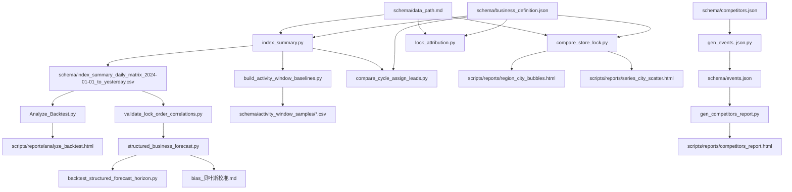

## scripts 脚本说明

### 脚本/文件索引

| 类型 | 文件                                              | 最后更新时间     | 作用                                                                              | 输入输出                                                                                                                                               |
| ---- | ------------------------------------------------- | ---------------- | --------------------------------------------------------------------------------- | ------------------------------------------------------------------------------------------------------------------------------------------------------ |
| 脚本 | `scripts/compare_store_lock.py`                   | 2026-04-29 00:00 | 对比车系“上市后 N 天”锁单（N 可用 --listing-plus-days 指定），新/老门店拆分；可选大区汇总与城市图（气泡图窗口可用 --region-city-bubble-days 指定） | 输入：`schema/data_path.md`（订单分析必需；可选大区 TSV）+ `schema/business_definition.json`；输出：stdout 对比表（可选榜单）+ 可选 `scripts/reports/*.html` |
| 脚本 | `scripts/index_summary.py`                        | 2026-04-27 14:30 | 单日/区间指标汇总；无参模式维护日度矩阵 CSV                                       | 输入：`schema/data_path.md`（订单/线索/试驾/可选归因等）；输出：stdout JSON（单日/可选）+ 矩阵 CSV（默认写入 schema/）                                 |
| 脚本 | `scripts/compare_cycle_assign_leads.py`           | 2026-04-21 20:13 | 对比两个窗口（A/B）线索相关指标均值；内部调用 index_summary                       | 输入：A/B 日期窗口（或已生成 JSON）+ `index_summary` 所需数据；输出：stdout 对比表 + `out/index_summary_*.json/.csv`（可写 md）                        |
| 脚本 | `scripts/Analyze_Backtest.py`                     | 2026-04-20 09:58 | 从日度矩阵生成综合可视化 HTML 报告（趋势/相关性/分层等）                          | 输入：日度矩阵 CSV；输出：`scripts/reports/analyze_backtest.html`                                                                                      |
| 脚本 | `scripts/gen_competitors_report.py`               | 2026-04-16 15:30 | 将 `schema/events.json` 渲染成竞品关键时间点 HTML 报告                            | 输入：`schema/events.json`；输出：`scripts/reports/competitors_report.html`                                                                            |
| 脚本 | `scripts/gen_events_json.py`                      | 2026-04-16 14:42 | 从 `schema/competitors.json` 为某车系生成竞品事件维护模板 `events.json`           | 输入：`schema/competitors.json`；输出：`schema/events.json`                                                                                            |
| 脚本 | `scripts/structured_business_forecast.py`         | 2026-04-16 10:54 | 结构化预测（锁单=leads×lock_rate），支持未来 N 天与整月、含 bias 校正与一句话结论 | 输入：日度矩阵 CSV + `schema/business_definition.json`；输出：stdout/文件 JSON（预测结果）                                                             |
| 脚本 | `scripts/backtest_structured_forecast_horizon.py` | 2026-04-16 10:54 | 对 structured_business_forecast 做不同 horizon 的滚动回测，选更稳的预测周期       | 输入：日度矩阵 CSV + `schema/business_definition.json`；输出：`out/structured_forecast_horizon_backtest.json`                                          |
| 脚本 | `scripts/validate_lock_order_correlations.py`     | 2026-04-16 10:54 | 计算锁单与候选指标相关性（含滞后）+ 简易回测，筛可用指标                          | 输入：日度矩阵 CSV；输出：`out/lock_order_correlation_validation.json`                                                                                 |
| 脚本 | `scripts/lock_attribution.py`                     | 2026-04-16 10:54 | 锁单归因汇总（渠道/分类/助攻等），可按渠道/车系过滤                               | 输入：`schema/data_path.md`（锁单归因必需；按车系可需订单分析）+ `schema/business_definition.json`；输出：stdout/文件 JSON                             |
| 脚本 | `scripts/build_activity_window_baselines.py`      | 2026-04-10 10:21 | 按 business_definition 的预售/上市窗口批量跑 index_summary，生成活动样本 CSV      | 输入：`schema/business_definition.json` + index_summary 所需数据；输出：`schema/activity_window_samples/*.csv`                                         |
| 目录 | `scripts/reports/`                                | 2026-04-21 20:31 | 脚本输出产物（HTML 报告/图）存放目录                                              | 输入：各脚本运行结果；输出：`*.html`                                                                                                                   |
| 文档 | `scripts/状态评估思路.md`                         | 2026-03-19 16:28 | 指标状态评估/诊断思路                                                             | 输入：-；输出：-                                                                                                                                       |
| 文档 | `scripts/bias_贝叶斯校准.md`                      | 2026-03-17 16:38 | bias 校正方法说明（与 structured_business_forecast 配套）                         | 输入：-；输出：-                                                                                                                                       |
| 文档 | `scripts/销量模拟器思路.md`                       | 2026-03-17 13:52 | 销量/锁单模拟思路草稿                                                             | 输入：-；输出：-                                                                                                                                       |
| 文档 | `scripts/index_指标体系思路.md`                   | 2026-03-17 10:05 | 指标口径/字段整理                                                                 | 输入：-；输出：-                                                                                                                                       |

### 常用命令

- 维护日度矩阵：`python3 scripts/index_summary.py`
- 单日 JSON：`python3 scripts/index_summary.py --date yesterday`
- 结构化预测（未来 14 天）：`python3 scripts/structured_business_forecast.py --forecast-days 14`
- 预测周期回测：`python3 scripts/backtest_structured_forecast_horizon.py`
- 锁单归因汇总：`python3 scripts/lock_attribution.py --start 2025-01-01 --end 2025-01-31`
- 车系锁单对比：`python3 scripts/compare_store_lock.py --by-region`

### 脚本关系（数据流/产物）

## structured_business_forecast.py 预测逻辑

默认参数（可通过命令行覆盖）：

- lookback_recent=30（近期趋势窗口）
- lookback_history=730（历史分布/分窗分位输入窗口）

### 核心恒等式

- 目标恒等式：锁单数 = 下发线索数 × 锁单率
- 对应指标：
  - 锁单数：`订单分析.锁单数`
  - 下发线索数：`下发线索转化率.下发线索数`
  - 锁单率：优先使用 `下发线索转化率.下发线索当30日锁单率`（缺失时回退 7 日）

### 四类窗口（regime）

- activity_high_eff：落在 business_definition.json 的 `time_periods.*.start ~ finish`（含端点）内，且满足：
  - 周期内周末（周六/周日），或
  - 关键窗口日：startday 后 3 天（含 startday）/ endday 前 3 天（含 endday）/ finishday 前 3 天（含 finishday）
- activity_low_eff：落在 `time_periods.*.start ~ finish`（含端点）内，但不满足 activity_high_eff 的日期
- weekday：不在 activity 的工作日
- weekend：不在 activity 的双休日

### 未来 N 天预测（默认口径）

- 取历史窗口（lookback_history）内样本，按 activity_high_eff / activity_low_eff / weekday / weekend 分窗，得到 leads 与 lock_rate 的分位输入
- 逐日生成未来 1..N 天预测（情景法，输出 `regime_quantile_based`）：
  - 每天先判定该日属于 activity_high_eff / activity_low_eff / weekday / weekend
  - leads 与 lock_rate 取对应 regime 的 P10 / P50 / P90，并叠加近 30 日正向趋势增量（`lead_daily_delta` / `rate_daily_delta`）
  - 计算当日锁单：`lock_orders_day = leads_day × lock_rate_day`
  - 汇总得到未来 N 天的 `period_lock_orders`
- 同时输出基于联合分布抽样的概率口径（输出 `regime_bootstrap`）：
  - 从历史窗口内的 (leads, lock_rate) 成对抽样（保留两者相关性），按未来每天的 regime 采样并叠加趋势
  - 生成 `period_lock_orders` 的样本分布后，取其 P10/P50/P90 与 mode（众数）作为未来 N 天的区间与最可能值

### bias 修正

- 基于滚动回测估计 `bias_rate = bias / mean_true`，并得到 `factor = 1 - bias_rate`
- 将预测区间合计按 `factor` 缩放得到校正后口径：
  - `regime_quantile_bias_corrected`：情景法的 P10/P50/P90 校正结果
  - `regime_bootstrap_bias_corrected`：bootstrap 概率口径的 P10/P50/P90/mode 校正结果（decision_summary 默认使用该口径）

### 整月预测（仅 --target-month）

- 已发生部分：从当月月初到 as_of 的真实锁单数直接加总
- 剩余部分：对当月剩余天数做同样的 bootstrap 预测，并做 bias 校正（得到 p10/p50/p90/mode）
- 合并得到整月区间与最可能值：`month_lock_orders_bias_corrected_p10/p50/p90/mode`
- 同时输出 `decision_summary`（顶层一句话，便于决策沟通）
