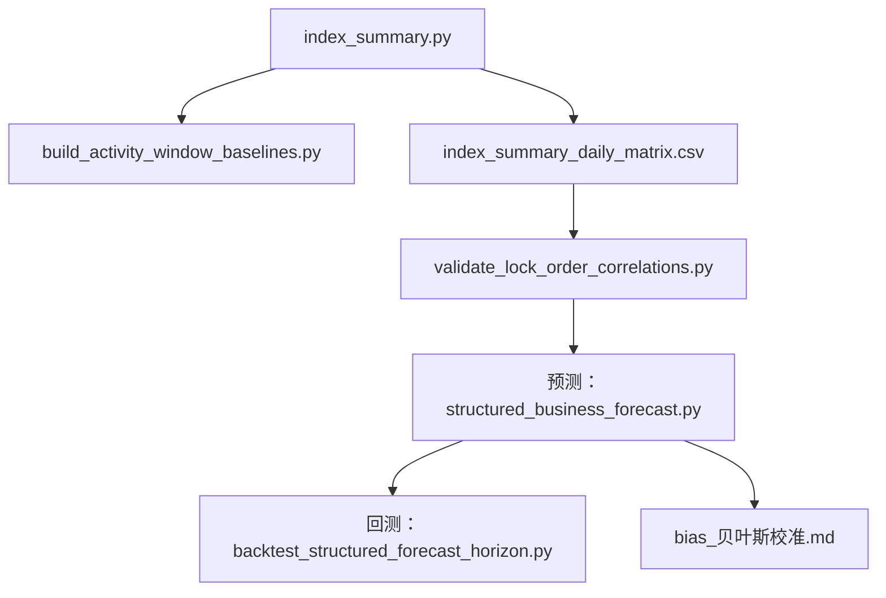

## scripts 脚本说明

- backtest_structured_forecast_horizon.py：对 structured_business_forecast.py 做多预测周期滚动回测，找出在历史数据上最准确的预测天数。
- build_activity_window_baselines.py：按 business_definition.json 的车型预售/上市窗口批量调用 index_summary.py 生成活动样本 CSV。
- index_summary.py：汇总并产出单日/区间业务指标，且在无参模式下增量维护 2024-01-01～yesterday 的日度矩阵 CSV。
- structured_business_forecast.py：基于日度矩阵做结构化预测（lock_orders=leads×lock_rate），按活动/工作日/双休三类窗口输出未来 N 天与整月预测（含 bias 修正与决策一句话）。
- validate_lock_order_correlations.py：从日度矩阵计算锁单数与候选指标的相关性及简易回测，对可用于预测的指标做筛选验证。

## structured_business_forecast.py 预测逻辑

### 核心恒等式

- 目标恒等式：锁单数 = 下发线索数 × 锁单率
- 对应指标：
  - 锁单数：`订单表.锁单数`
  - 下发线索数：`下发线索转化率.下发线索数`
  - 锁单率：优先使用 `下发线索转化率.下发线索当30日锁单率`（缺失时回退 7 日）

### 三类窗口（regime）

- activity：落在 business_definition.json 的 `time_periods.*.start ~ finish`（含端点）的日期
- weekday：不在 activity 的工作日
- weekend：不在 activity 的双休日

### 未来 N 天预测（默认口径）

- 先基于历史样本分别计算 activity / weekday / weekend 的 leads 与 lock_rate 的 P10 / P50 / P90 分位输入
- 逐日生成未来 1..N 天预测：
  - 每天先判定该日属于 activity / weekday / weekend
  - leads 与 lock_rate 取对应 regime 的分位值，并叠加近 30 日正向趋势增量（`lead_daily_delta` / `rate_daily_delta`）
  - 计算当日锁单：`lock_orders_day = leads_day × lock_rate_day`
- 汇总输出 `regime_quantile_based`（p10/p50/p90 的日均与区间合计）

### bias 修正

- 基于滚动回测估计 `bias_rate = bias / mean_true`，并得到 `factor = 1 - bias_rate`
- 将 p10/p50/p90 的区间合计按 `factor` 缩放得到 `regime_quantile_bias_corrected`

### 整月预测（仅 --target-month）

- 已发生部分：从当月月初到 as_of 的真实锁单数直接加总
- 剩余部分：对当月剩余天数做同样的 p10/p50/p90 预测，并做 bias 校正
- 合并得到整月区间：`month_lock_orders_bias_corrected_p10/p50/p90`
- 同时输出 `decision_summary`（顶层一句话，便于决策沟通）
